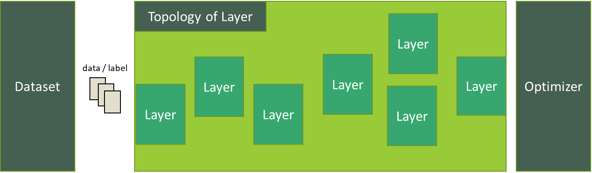

# Machine Learning Training

Machine Learning Training allows to construct, control and train a machine learning model in Tizen devices.

Please note that:

* This feature remains experimental for Tizen 6.0 and is not full-fledged yet for every needs.
* Every example code is not fully handling error for brevity. Error should be handled more extensively then example code written here.

## Prerequisites

To enable your application to use the machine learning training functionality:

1. To use the functions and data types of the Machine Learning Inference API, include the `<nntrainer.h>` header file in your application:

   ```c
   #include <nntrainer.h>
   ```

2. To use the Machine Learning Training API, include the following features in your `tizen-manifest.xml` file:

   ```xml
   <feature name="http://tizen.org/feature/machine_learning">true</feature>
   <feature name="http://tizen.org/feature/machine_learning.training">true</feature>
   ```

3. If you want to save/load model files from outside, the application has to request permission by adding following privileges to the `tizen-manifest.xml` file:

  ```xml
  <privileges>
    <!-- For accessing media storage -->
    <privilege>http://tizen.org/privilege/mediastorage</privilege>
    <!-- For accessing external storage -->
    <privilege>http://tizen.org/privilege/externalstorage</privilege>
  </privileges>
  ```

## Building Blocks

There are 4 major components you need to get familiar with. With those components, you can prepare a model and run.

### Model



Model is a wrapper component that has topology of layers, optimizers, datasets.
Model conducts training and update parameters that can later be used for inference.
Please note only sequential topology is supported for the time being.

```c
// Create model
ml_train_model_h model;
ml_train_model_construct(&model);

/* Configure models(omitted for brevity) */

// Compile model, this freezes model and cannot modify model afterwards.
ml_train_model_compile(model, "loss=cross", "batch_size=16", NULL);
// run model
ml_train_model_run(model, "epochs=2", "save_path=model.bin", NULL);

// destroy after use
ml_train_model_destroy(model);
```

### Layer

Layer is a component that does actual computation while managing internal trainable parameters.

```
/***************************************
 * Data(x)  -> Layer(F) -> Data(F(X))  *
 * Data(dx) <-    ...   <- Data(dF(X)) *
 ***************************************/
```

```c
// Create layer
ml_train_layer_h layer;
ml_train_layer_create(&layer, ML_TRAIN_LAYER_TYPE_FC);

// configure layer
ml_train_set_property(layer, "unit=10", "activation=softmax", "bias_initializer=zeros", NULL);

// after add layer to model,
// you do not need to destroy layer since ownership is transferred to the model.
ml_train_model_add_layer(model, layer);
```

### Optimizer

Optimizer determines how to update model parameters according to loss from prediction.
Currently, Stochastic gradient descent optimizer and Adam optimizer are supported.

```c
// Create optimizer
ml_train_optimizer_h optimizer;
ml_train_optimizer_create(&optimizer, ML_TRAIN_OPTIMIZER_TYPE_SGD);

// configure optimizer
ml_train_optimizer_set_property(optimizer, "learning_rate=0.001", NULL);

// after configuring optimizer to model
// you do not need to destroy optimizer since ownership is transferred to the model.
ml_train_model_set_optimizer(model, optimizer);
```

### Dataset

Dataset is in charge of feeding data into the model.
It can either be created from callback function or created from a file.
Detail will be discussed in [upcoming](#prepare-model) section.

```c
// Create dataset
ml_train_dataset_h dataset;
ml_train_dataset_create_with_generator(&dataset, generator_train_cb, generator_valid_cb, generator_test_cb);

// configure dataset
ml_train_dataset_set_property(dataset, "buffer_size=100", NULL);

// after set dataset to model,
// you do not need to destroy dataset since ownership is transferred to the model.
ml_train_model_set_dataset(model, dataset);
```

## Construct Model

To run the model, you need to construct model. Model can be constructed with `ml_train_model_construct`.
If you have file that describe model, the file can be used to construct initially with `ml_train_model_construct_with_file`.
Even if you constructed model from a file, you can switch/modify/add each component with set of given apis until you compile with `ml_train_model_compile`.

### Construct Model from the Description File

As of now, only `*.ini` is supported to construct model from a file.

#### Create Model from ini Format

There are special sections refering to `model` and `dataset` respectively [Model] and [Dataset]
Each ini section maps to a `layer`. Keys and values from each section sets property.
Invalid Property will be ignored safely, invalid values will cause error. All keys and values are case-insensitive

For example,

```ini
[Model] # Special section that describes model property
Type = NeuralNetwork	# Model Type : only NeuralNetwork is supported as of now
Optimizer = adam 	# Optimizer : sgd (stochastic gradient decent),
 	    		#             adam (Adaptive Moment Estimation)
#### optimizer related properties
Learning_rate = 0.0001 	# Learning Rate for the optimizer
Decay_rate = 0.96	# for the decay_rate for the decayed learning rate
Decay_steps = 1000       # decay step for the exponential decayed learning rate
beta1 = 0.9 		# beta 1 for adam
beta2 = 0.9999	# beta 2 for adam
epsilon = 1e-7	# epsilon for adam

#### Model compile related properties
batch_size = 9
loss = cross  		# Cost(loss) function : mse (mean squared error)
                        #                       cross (cross entropy)

####  Model run related properties
Epochs = 20 		# Epochs
save_path = "model.bin"  	# model path to save / read parameters

[DataSet] # Special section that describes dataset.
BufferSize=9
TrainData="trainingSet.dat"
ValidData="validationSet.dat"
LabelData="label.dat"

# Layer Sections, each section name refers to name of the layer
[inputlayer]
Type = input
Input_Shape = 1:1:62720	# Input Layer Dimension channel:height:width
Normalization = true

[outputlayer]
Type = fully_connected
Unit = 2		# Output Layer Dimension ( = Weight Width )
bias_initializer = zeros
Activation = sigmoid 	# activation : sigmoid, softmax
Weight_Decay = l2norm
weight_Decay_Lambda = 0.005
```

There are some restriction that must be kept:

 * Model file must have `[Model]` section that describe model property
 * Model file must have at lease one layer.
 * Valid keys must have valid properties (while invalid keys in each section will be ignored.)

Please note that all path are relative to current working directory unless stating absolute path.
It is recommended to set `save_path` and `Dataset` from the code over describe inside the model file.

Following example constructs model from ini file

```c
char *res_path = app_get_resource_path();
char model_path[1024];
ml_train_model_h model;

snprintf(model_path, sizeof(model_path), "%s/model.ini", res_path);
free(res_path);

status = ml_train_model_construct_with_conf(model_path, &model);
if(status != ML_ERROR_NONE) {
  // handle error
}
```

### Construct Model on the Code

If you want to construct empty model, this can be done with `ml_train_model_construct`. In this fashion, you are able to create model with no layer added.

## Configure Model

After constructing a model, you are able to configure model as follows. This section provides example code to reproduce model description from [Create Model from ini Format](#create-model-from-ini-format)

Except that:
 * Relative path is changed to app resource / data path.
 * Model related properties (which can be set at compile / run phase)
 * Demonstration about `ml_train_dataset_create_with_generator` which can't be covered in the description file.

First you need to create empty model.

```c
ml_train_model_h model;
ml_train_model_construct(&model);
```

### Add Layer

You can add layer after setting the appropriate property.

```c
int status = ML_ERROR_NONE;
ml_train_layer_h layers[2];

// create and add input layer
status = ml_train_layer_create(&layers[0], ML_TRAIN_LAYER_TYPE_INPUT);
if(status != ML_ERROR_NONE) {
  // handle error
}

status = ml_train_layer_set_property(layers[0], "name=inputlayer",
                                                "input_shape=1:1:62720",
                                                "normalization=true", NULL);
if(status != ML_ERROR_NONE) {
  //handle error
}
status = ml_train_model_add_layer(model, layers[0]);

// create and add fully connected layer
status = ml_train_layer_create(&layers[1], ML_TRAIN_LAYER_TYPE_FC);
status = ml_train_layer_set_property(layers[1], "name=outputlayer",
                                                "unit=2",
                                                "bias_initializer=zeros",
                                                "activation=sigmoid",
                                                "weight_decay=l2norm",
                                                "weight_decay_lambda=0.005", NULL);
status = ml_train_model_add_layer(model, layers[1]);
```

### Set Optimizer

You can create and add optimizer in the same manner as `layer`

```c
status = ml_train_optimizer_create(&optimizer, ML_TRAIN_OPTIMIZER_TYPE_ADAM);
status = ml_train_optimizer_set_property(optimizer, "learning_rate=0.0001",
                                                    "decay_rate=0.96",
                                                    "decay_steps=1000",
                                                    "beta1=0.002",
                                                    "beta2=0.001",
                                                    "epsilon=1e-7", NULL);
status = ml_train_model_set_optimizer(model, optimizer);
```

### Set Dataset

There are two ways to create dataset. One is from file, and another one is from callback.
In either fashion, you need to provide streams of tensor data and one-hot-encoded label.

#### Set Dataset from File

If you want to provide dataset from file.

You must provide training set, and label.
You can optionally provide validation set and test set.

label is a file that has actual label each in a line.

```
airplane
automobile
bird
cat
deer
dog
frog
horse
ship
truck

```

Each dataset should have raw float array data and label

```
[float array for data1][label(on-hot encoded) for data1][float array][label]...
```

After preparing label and dataset, you can create `dataset` as follows

```c
int status = ML_ERROR_NONE;
ml_train_dataset_h dataset;

char *res_path = app_get_resource_path();
char train_path[1024];
char label_prop[1024];

snprintf(train_path, sizeof(train_path), "%s/training.dat", res_path);
snprintf(label_prop, sizeof(label_prop), "label_data=%s/label.dat", res_path);
free(res_path);

status = ml_train_dataset_create_with_file(&dataset, train_path);
if(status != ML_ERROR_NONE) {
  // handle error
}

status = ml_train_dataset_property(dataset, label_prop,
                                   "buffer_size=9", NULL);
status = ml_train_model_set_dataset(model, dataset);
```

#### Set Dataset from Generator

If you want to provide dataset from the code, you can provide a callback function to provide data.

First, you need to create a callback.
```c
/**
 * @brief      get data which size is batch for train
 * @param[out] data
 * @param[out] label
 * @param[out] last if the data is finished
 * @param[in] user_data private data for the callback
 * @retval status for handling error
 */
int get_train_data(float **data, float **label, bool *last, void *user_data) {
  /* code that fills data, label and last */
  return ML_ERROR_NONE;
}
```

And you are ready to create dataset.

```c
int status = ML_ERROR_NONE;
ml_train_dataset_h dataset;

// validation and test callback can be omitted.
status = ml_train_dataset_create_with_generator(&dataset, get_train_data,
                                                NULL, NULL);
```

## Compile Model

Compile model finalizes the model with given loss.
Once compiled, any modification to the properties of model or layers/dataset/optimizer in the model will be restricted.
Further, addition of layers or changing the optimizer/dataset of the model will not be permitted.

```c
int status = ML_ERROR_NONE;

status = ml_train_model_compile(model, "loss=cross", "batch_size=9", NULL);)
```

## Train Model

Now, model is ready to train. You can train model with following code.

```c
int status = ML_ERROR_NONE;

status = ml_train_model_run(model, "epochs=20", "save_path=model.bin", NULL);)
```

## Destroy Model

After use, you can destroy model with `ml_train_model_destroy`.
Note that `ml_train_model_add_layer`, `ml_train_set_optimizer`, `ml_train_set_dataset` transferrers ownership to `model`.
`layers`/`optimizers`/`dataset` which belongs to `model` will also be deleted.

## Related Information

- Dependencies
  - Tizen 6.0 and Higher for Mobile
  - Tizen 6.0 and Higher for Wearable
